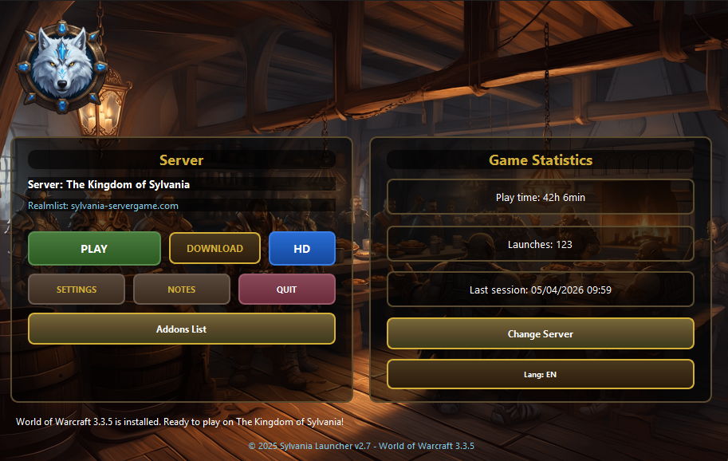
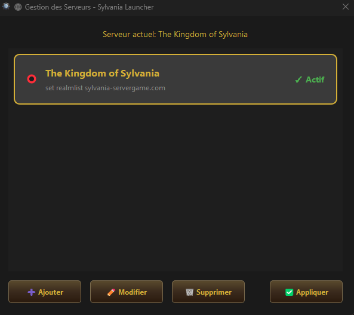
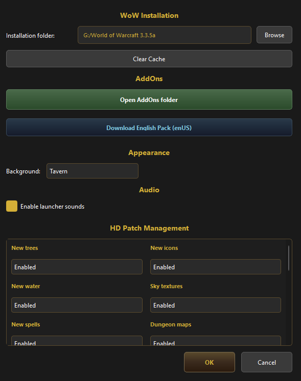
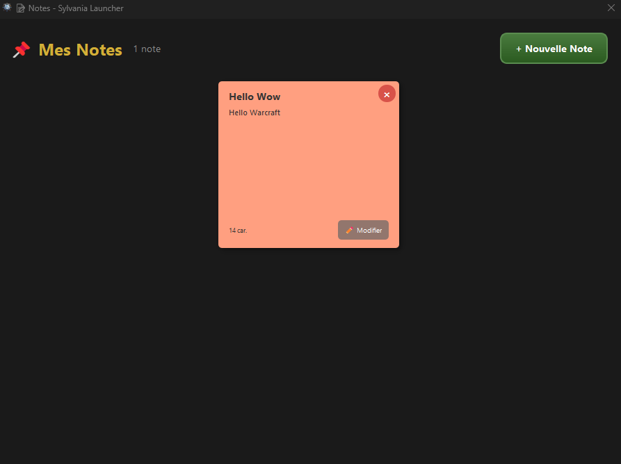

# Sylvania Launcher

🎮 **Launcher officiel pour le serveur World of Warcraft - Sylvania**

## Aperçu

### Interface Principale


### Gestion des Serveurs


### Réglages


### Notes (Style Post-it)


## Fonctionnalités

- 🎮 **Lancement du jeu** avec configuration automatique du realmlist
- 📥 **Téléchargement du client WoW** 3.3.5 avec progression en temps réel
- 💎 **Patch HD Sylvania** : Installation automatique du patch haute définition (Data, Interface, PatchMenu)
- ⚙️ **Auto-Configuration** : Génération automatique du fichier `Config.wtf` optimal
- 📊 **Statistiques de jeu** : temps de jeu, nombre de lancements
- 📝 **Notes personnelles** style post-it avec couleurs
- ⚙️ **Réglages** : chemin WoW (sélection libre), cache, AddOns, sons
- 🔄 **Gestion des serveurs** : ajouter, modifier, supprimer

## Version actuelle

**v2.5.0** - Application native C++ / Qt6

### Nouveautés v2.5.0
- 🛠️ **Gestion modulaire HD** : Activez ou désactivez les éléments du patch HD (Arbres, Eau, Sorts, etc.) directement depuis les réglages.
- 🔍 **Détection intelligente** : Le launcher détecte maintenant si le patch HD est déjà installé pour éviter les erreurs de manipulation.
- ⚙️ **Stabilité du Build** : Amélioration du système de compilation sur Windows pour une meilleure robustesse.

## Téléchargement

[Télécharger le launcher](https://sylvania-servergame.com/launcher)

## Configuration requise

- Windows 10/11 (64-bit)
- 100 MB d'espace disque (launcher uniquement)
- Connexion Internet

## Compilation

### Prérequis
- Qt 6.x
- CMake 3.16+
- MinGW ou MSVC

### Build
```bash
cd cpp
mkdir build && cd build
cmake ..
cmake --build .
```

## Licence

⚠️ **Source-Available License** - Ce code est disponible en lecture seule pour analyse et audit de sécurité. Aucune redistribution, modification ou utilisation commerciale n'est autorisée.

Voir [LICENSE](LICENSE) pour les détails complets.

## Auteur

© 2025 Sylvania - Tous droits réservés.
